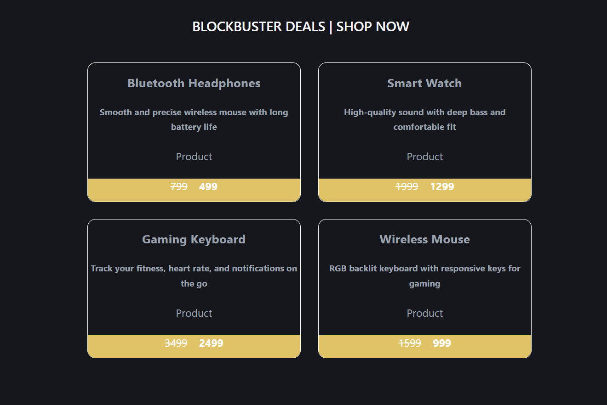

# 🛒 Amazon Clone (React Beginner Project)

This is a simple Amazon-style product listing UI built using React.
The project focuses on understanding core React concepts through a hands-on mini clone.

---

## 📸 Preview

### Product Cards


---

## 🚀 Features

* 📦 Product cards with title, description, and pricing
* 💸 Old price vs new price display
* ♻️ Reusable components (Product & Price)
* 🎯 Dynamic rendering using props and arrays
* 🎨 Basic styling with CSS

---

## 🛠️ Tech Stack

* React (Vite)
* JavaScript (ES6)
* HTML5 & CSS3

---

## 📂 Project Structure

```
src/
│
├── Product.jsx      # Displays product details
├── Price.jsx        # Handles pricing UI
├── ProductTab.jsx   # Renders multiple products
├── Product.css      # Styling
└── App.jsx
```

---

## 📚 What I Learned

* Creating and using React components
* Passing data via props
* Using arrays to render dynamic content
* Component reusability
* Basic UI structuring in React

---

## ▶️ Run the Project

```bash
npm install
npm run dev
```

---

## 📌 Future Improvements

* 🛒 Add Cart functionality
* 🔄 Use `.map()` instead of index-based rendering
* 🌐 Add routing (React Router)
* 🔗 Connect to backend (MERN stack)
* 🎨 Improve UI to match real Amazon design

---

## 🙌 Conclusion

This project helped me strengthen my React fundamentals by building a real-world inspired UI.
It serves as a foundation for more advanced full-stack applications.

---

⭐ Part of my journey to becoming a Full Stack Developer.
